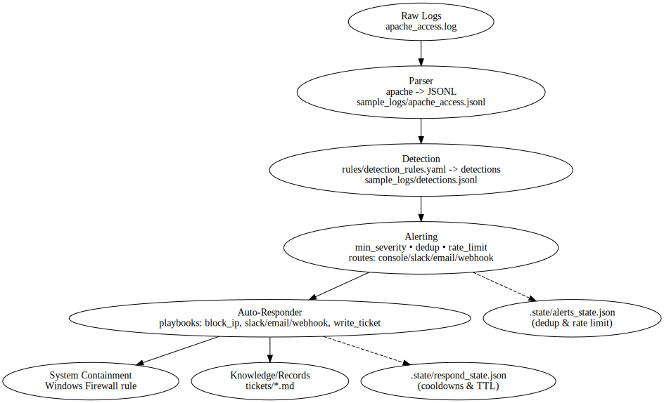

# Security Log Analyzer & Auto-Responder

End-to-end log analysis pipeline built in Python — from raw web server logs to detections, alerting, and automated response.

This project was developed to demonstrate core concepts in log processing, detection engineering, alert routing, and automated response (similar to a lightweight SIEM + SOAR).  
Tested primarily on Windows 11 with PowerShell, but portable to Linux/Mac.

---

## Features

### Ingest & Parse
- Parser for Apache combined access logs.
- Output normalized JSONL format (line-delimited JSON).
- JSONL is chosen for easy streaming and compatibility with downstream systems (e.g., ELK, Splunk, BigQuery).

### Detection Engine
- Rule-driven detection using YAML.
- Supports severity levels, aggregation, and descriptive summaries.
- Produces structured detection objects in JSONL.

### Alerting Engine
- Global severity threshold, deduplication, and per-rule rate limiting.
- Multiple alert routes supported:
  - Console
  - Slack (Incoming Webhook)
  - Email (SMTP)
  - Generic HTTP Webhook
- Alerts rendered with Jinja2 templates (Markdown by default).
- Secrets (SMTP credentials, webhook URLs) loaded from environment variables.

### Auto-Responder
- Playbook-driven response in YAML.
- Actions supported:
  - `block_ip` (Windows Firewall inbound block)
  - `slack_notify`
  - `email_notify`
  - `http_webhook`
  - `write_ticket` (append Markdown ticket file)
- TTL-based containment with automatic cleanup.
- Cooldowns per action to avoid repeated response storms.
- Guardrails prevent blocking private/reserved IP ranges.
- Dry-run mode for safe testing.

---

## Quick Start

### 1. Setup (Windows PowerShell)
```powershell
git clone https://github.com/omilescuvlad/security-log-analyzer.git
cd security-log-analyzer

python -m venv .venv
.\.venv\Scripts\Activate.ps1
pip install -r requirements.txt
```

### 2. Run demo pipeline

#### Parse Apache logs -> JSONL
python cli.py ingest file --file sample_logs/apache_access.log

#### Run detection
python cli.py detect run sample_logs/apache_access.jsonl --out sample_logs/detections.jsonl

#### Alerting (dry-run, console only)
python cli.py alert run sample_logs/detections.jsonl --dry-run

#### Auto-Responder (dry-run, safe mode)
python cli.py respond run sample_logs/detections.jsonl --dry-run

# Example Outputs

## Detection table

```pysql
┏━━━┳━━━━━━━━━━━━━━━━┳━━━━━━━━━━┳━━━━━━━━━━━━━━━┳━━━━━━━┳━━━━━━━━━━━━━━━━━━━━━━━━━━━━━━━━━━━━━━━━━━━━━━━━━━━━━━━┳━━━━━━━━━━━━━━━━━━━━━━━━━━━━━━━━━━━━━━━━━━━━━━━━━━━━━━━━━━┓
┃ # ┃ Rule ID        ┃ Severity ┃ Src IP        ┃ Count ┃ Window UTC                                            ┃ Summary                                                  ┃
┡━━━╇━━━━━━━━━━━━━━━━╇━━━━━━━━━━╇━━━━━━━━━━━━━━━╇━━━━━━━╇━━━━━━━━━━━━━━━━━━━━━━━━━━━━━━━━━━━━━━━━━━━━━━━━━━━━━━━╇━━━━━━━━━━━━━━━━━━━━━━━━━━━━━━━━━━━━━━━━━━━━━━━━━━━━━━━━━━┩
│ 1 │ SUSPICIOUS_UA  │ low      │ 192.168.0.10  │     1 │ 2025-09-03T07:20:15+00:00 → 2025-09-03T07:20:15+00:00 │ Suspicious or tool-like User-Agent                       │
│ 2 │ SENSITIVE_PATH │ medium   │ 203.0.113.45  │     1 │ 2025-09-03T07:21:00+00:00 → 2025-09-03T07:21:00+00:00 │ Access to sensitive/admin path                           │
│ 3 │ SQLI_IN_URL    │ high     │ 198.51.100.23 │     1 │ 2025-09-03T07:22:10+00:00 → 2025-09-03T07:22:10+00:00 │ Possible SQL injection keywords found in URL             │
└───┴────────────────┴──────────┴───────────────┴───────┴───────────────────────────────────────────────────────┴──────────────────────────────────────────────────────────┘
```

## Console alert (dry-run)

```yaml
================================================================================
[Console route: console-dev] [HIGH] SQLI_IN_URL x1
# Security Alert
Rule: SQLI_IN_URL
Severity: high
Source IP: 198.51.100.23
Summary: Possible SQL injection keywords found in URL
```

## Ticket file (Markdown)

```markdown
# Incident Ticket

When (UTC): 2025-09-03T07:22:10+00:00
Rule: SQLI_IN_URL
Severity: HIGH
Source IP: 198.51.100.23
Count: 1

Summary:
Possible SQL injection keywords found in URL

Responder Notes:
- Actions taken: block_ip, slack_notify, ticket
```

## Architecture Diagram




